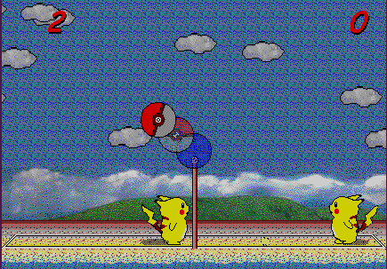
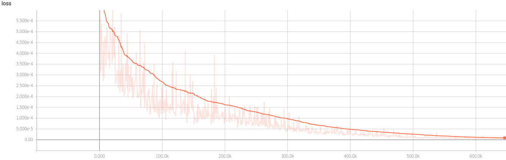
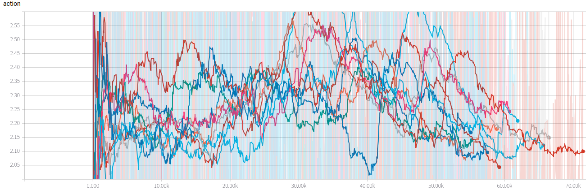
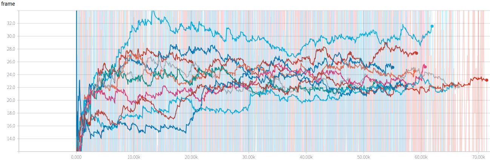
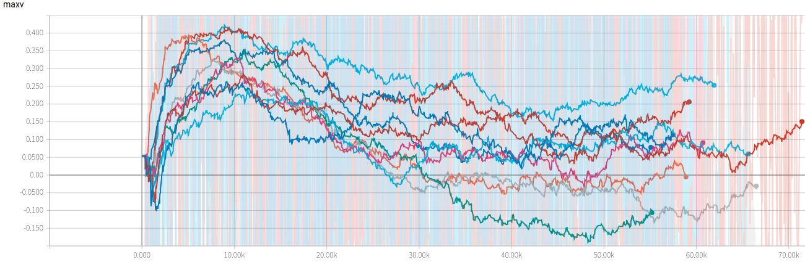
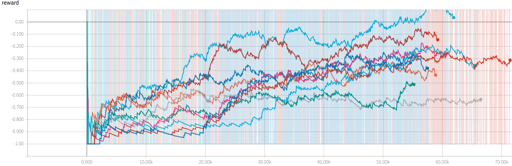

# Alphachu: Ape-x DQN implementation of Pikachu Volleyball
### [[Demo]](https://www.youtube.com/watch?v=vSkLegIUD98)[ [Paper]](https://arxiv.org/abs/1803.00933) 
Training agents to learn how to play Pikachu Volleyball. Architecture is based on Ape-x DQN from the [paper](https://arxiv.org/abs/1803.00933). The game is in exe file which makes the whole problem much more complicated than other Atari games. I built python environment to take screenshot of the game to provide as state and detect the start and end of game. I used mss to take screen shot, cv2 to preprocess image, pynput to press the keyboard, and tensorboardX to record log. I created a number of virtual monitors with Xvfb for each actor. To provide different key input to each monitor, the architecture had to be multi-process. A learner only trains on GPU and many(Assume 10) actors collected data from virtual monitors. They communicate through files in log directory. 

As it sounds, it is complicated. My method seems pretty primitive but it was the only way to train pikachu volleyball.



## Before start
 - I tried this in Ubuntu and Mac. 
 - Reset log_directory and data_directory in actor.py, and learner.py. 

## Prerequisites
- Install PyTorch dependencies from http://pytorch.org
- Install requirements.txt (```pip install -r requirements.txt```)
- Install Xvfb(```sudo apt-get install xvfb -y```)

## Creating Virtual Monitors with Xvfb
Repeat this for 10 times to create virtual monitors. 
```
Xvfb :99 -ac -screen 0 1280x1024x24 > /dev/null &
echo "export DISPLAY=:99" >> ~/.bashrc
```

## Run learner
Run learner and copy the model timestamp with configuration.
```
python learner.py --actor-num 10
Learner: Model saved in  /home/sungwonlyu/experiment/alphachu/180801225440_256_0.0001_4_84_129_32_1_30000_1500_10/model.pt
```

## Run actors
Run pika.exe and actor in virtual monitor. Also need to do this 10 times with varying epsilons. 
```
DISPLAY=:99 wine pika.exe
DISPLAY=:99 python actor.py --load-model 180801225440_256_0.0001_4_84_129_32_1_30000_1500_10 --epsilon 0.9 --wepsilon 0.9
```

## Test
To see the performance of the agent, reset screen-size in environment.py to set the place for screen shot. Then place the pika.exe to the area and start a actor with trained model. 
```
wine pika.exe
python actor.py --load-model 180801225440_256_0.0001_4_84_129_32_1_30000_1500_10 --test
```

## Result
### Demo
You can find demo on [youtube](https://www.youtube.com/watch?v=vSkLegIUD98). 

### Graphs
0.99 smoothed graphs for the first 7 days.
#### Loss


#### Action


#### Frame


#### Max Value


#### Reward


#### Total reward
My score - computer score (-15 ~ 15)

